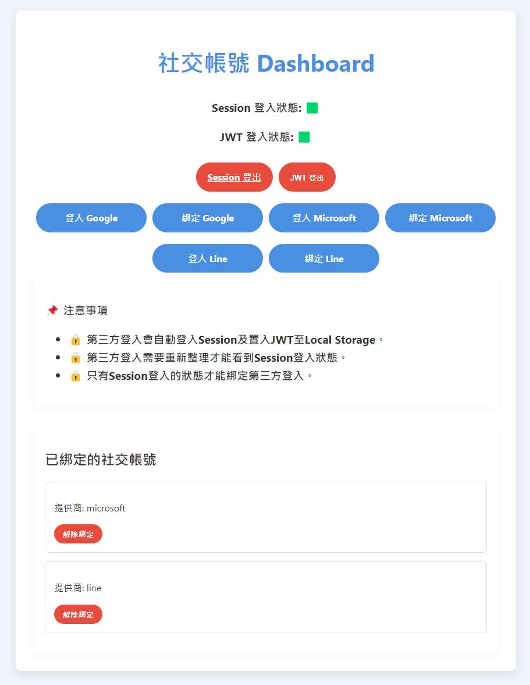

# Django Allauth JWT Template



> All 3rd party authentication is handled by Django Allauth and they are server side rendered(SSR).

A Django project template with Django Allauth and JWT authentication.

## Description

This template is for those who want to use JWT for their frontend and backend.

## Usage

1. Copy `.env.example` to `.env` and set the environment variables.

    ```bash
    cd backend && cp .env.example .env
    ```

2. Install requirements.

    ```bash
    pip install -r requirements.txt
    ```

3. Migrate and run server.

    ```bash
    cd backend && python manage.py migrate
    ```

    ```bash
    cd backend && python manage.py runserver 0.0.0.0:5566
    ```

4. Visit `http://localhost:5566`.

5. (Optional) Create a superuser.

    ```bash
    python manage.py createsuperuser
    ```

6. (Optional) Visit `http://localhost:5566/admin` to see the users.

7. (Optional) When login with `superuser`, you can visit `http://localhost:5566/api/__hidden_swagger` to see the API documentation.


## Key Points

- Allauth Login Login
    [./backend/authentication/adapter.py](./backend/authentication/adapter.py).

- JWT API
    [./backend/custom_jwt/views.py](./backend/custom_jwt/views.py).

- Frontend Login
    - HTML
        [./backend/dashboard/templates/index.html](./backend/dashboard/templates/index.html).
    - JavaScript
        [./backend/dashboard/static/js/dashboard.js](./backend/dashboard/static/js/dashboard.js).

- Frontend 3rd Party Login Routes

    The routes are defined in `django-allauth` and you can find the main pattern in [./backend/authentication/urls.py](./backend/authentication/urls.py).

    ```html
    <!-- ./backend/dashboard/templates/index.html -->
    <div id="loginButtons">
        <a title="Google" href="/api/allauth/google/login/?process=login" class="social-login-btn">登入 Google</a>
        <a title="Google" href="/api/allauth/google/login/?process=connect" class="social-login-btn">綁定 Google</a>
        <a title="Microsoft" href="/api/allauth/microsoft/login/?process=login" class="social-login-btn">登入 Microsoft</a>
        <a title="Microsoft" href="/api/allauth/microsoft/login/?process=connect" class="social-login-btn">綁定 Microsoft</a>
    </div>
    ```

## Misc

I added a file named `./backend/templates/account/messages/logged_in.txt` to avoid login success message in `Admin` login panel.